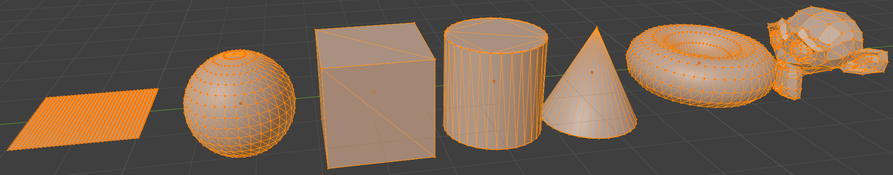

# Project Template

> You may remove the content of this file and put your documentation here.

This is a minimal template you can use as a starting point for your project. It's similar to the exercises and contains:

- simple geometry setup (position and uv)
- minimal matrix calculation
- a slider that can be read with `document.querySelector("#slider").value`
- minimal shaders
- mesh data for some basic shapes can be found in `mesh-data.js`
  - by placing those in your scene with different transforms, you should be able to create an interesting scene without having to load external assets from 3D files (like obj, gltf, fbx).
  - 
- you can use your own or external meshes with the help of this [mesh loader](https://gitlab.mi.hdm-stuttgart.de/computer-graphics/mesh-loader).

## Usage with Visual Studio Code

1. Open the folder where this `README` is located with VSCode (`File` > `Open Folder...`).
2. Install the Extension [Live Server](https://marketplace.visualstudio.com/items?itemName=ritwickdey.LiveServer). With this extension you can launch a local static file server.
3. Right-click `index.html` of the exercise you want to work on and click `Open with Live Server`.
4. The website opens in your default browser. Everytime you save a file in VSCode, the browser tab gets refreshed.
5. Install the Extension [Shader languages support for VS Code](https://marketplace.visualstudio.com/items?itemName=slevesque.shader) to get syntax highlighting for the shaders we will write.

## Alternatives to Visual Studio Code

If you want to use another code editor, that's also completely fine. In that case you will need another static file server. You may use one of those command line servers:

- `npx http-server` (Node.js)
- `npx five-server` (Node.js)
- `python -m SimpleHTTPServer` (Python 2.x)
- `python -m http.server` (Python 3.x)
- `php -S localhost:8000` (PHP 5.4+)

## Why do we need a static file server?

The shader code is stored in text files (like `shader.frag`, `shader.vert`). We want to read the files from javascript. This is only possible with a static file server.
